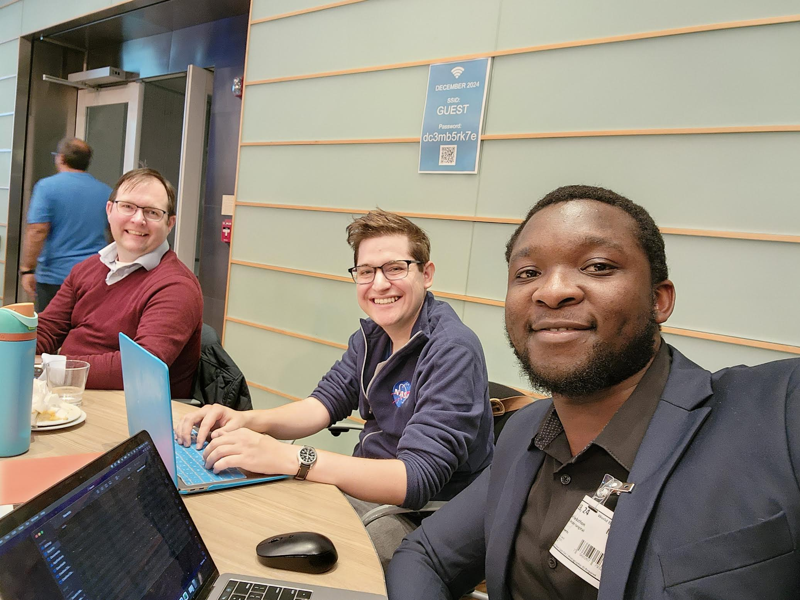

# Data Community DC World Bank Data Dive - 12/18/2024

## Contributions from
* LINCOLN CHANAKIRA
* ALEX GURVICH
* JEREMY SKOG
* KYLE SPENCER (not pictured)

From left to right: Jeremy, Alex, Lincoln

## Challenge Statement

### Poverty Alleviation
#### CONTEXT:
Poverty and inequality can vary hugely within countries. Understanding where these spatial inequalities exist and how they evolve over time is crucial to fighting global poverty.

#### CHALLENGE:
Using data from the Subnational Poverty and Inequality Database (SPID) or Global Subnational Atlas of Poverty (GSAP), what can we learn about how poverty and inequality vary within a country and change over time, and is there any spatial relations with other spatial data? The subnational indicators can be merged with other spatial data, such as climate variables. What factors help to explain the differences across space within countries and how they change over time?

#### DATA SOURCES:
GSAP and SPID, and any open access spatial data.

### Poverty Alleviation
#### CONTEXT:
The World Bank’s Geospatial Poverty Portal is a relatively new website that hosts two interactive map portals. The World Bank is interested in showcasing compelling and actionable visualizations to increase awareness and action to overcome subnational poverty issues, which could be showcased on the portal itself.

#### CHALLENGE:
Build a Country Graphics page using data from the Subnational Poverty and Inequality Database (SPID) and/or Global Subnational Atlas of Poverty (GSAP). For example, cross-country comparisons, pie-charts, time-series can be added to a “Country Graphics” container that will be placed in the map portals. Graphs should be flexible meaning they should automatically update depending on the country selected. The Graphics container can also house other relevant country information such as links to World Bank country reports, or SDG indicators.

#### DATA SOURCES:
GSAP and SPID, and any open access spatial data.

Try out the [live demo](https://alexbgurvi.ch/worldbank-datadive/) of our app.

If you'd like more information, check out [our presentation](https://alexbgurvi.ch/worldbank-datadive/wb-dd-presentation.pdf).